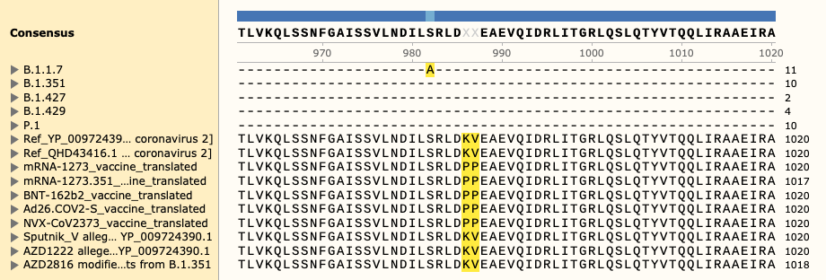
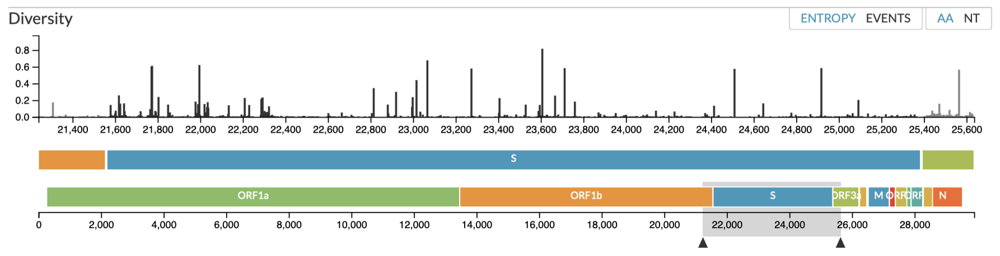
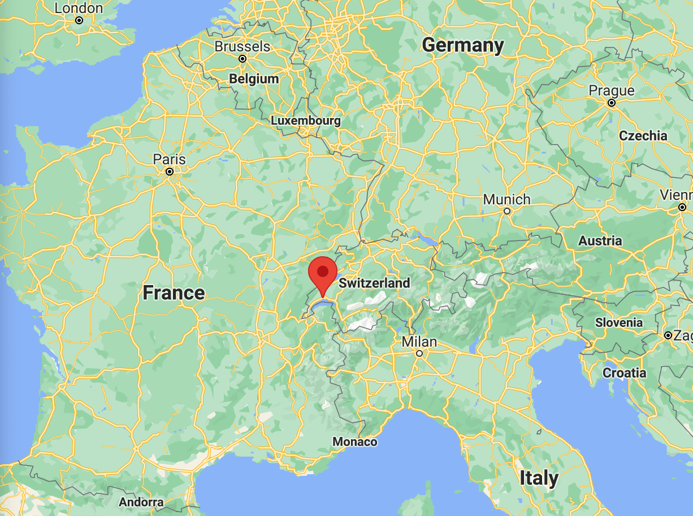

# Variants of concern aligned to SARS-CoV-2 vaccine coding sequences

This work has not been peer reviewed.

[Open PDF visualisation - variants_of_concern_to_vaccine.pdf](./variants_of_concern_to_vaccine.pdf)

## Aims and results overview
* To produce standardized alignments of vaccine sequences.
* Determine which are at risk to emerging variants.

From the data presented within:

1. The translated amino acid sequences for all vaccines were derived.
2. These were aligned to the SARS-CoV-2 reference amino acid sequences of spike (S) glycoprotein.
3. Known variants-of-concern were then annotated and visualised.

Variants-of-concern for five SARS-CoV-2 strains 
([CDC 4 Jun 2021](https://www.cdc.gov/coronavirus/2019-ncov/variants/variant-info.html?CDC_AA_refVal=https%3A%2F%2Fwww.cdc.gov%2Fcoronavirus%2F2019-ncov%2Fcases-updates%2Fvariant-surveillance%2Fvariant-info.html))
are illustrated against the 
translated amino acid sequences of the vaccines; 

* Moderna mRNA-1273
* Pfizer/BioNTech BNT-162b2
* Janssen/Johnson & Johnson Ad26.COV2-S
* Novavax NVX-CoV2373
* Curevac CVnCoV
* Sputnik V
* AstraZeneca AZD1222

and reference protein/genome sequences;

* QHD43416.1 [MN908947.3] and
* YP\_009724390.1 [NC\_045512.2].

The variants-of-concern are shown here, illustrated on the protein structure;
[6ZOX.pdb DOI: 10.2210/pdb6ZOX/pdb](https://www.rcsb.org/structure/6ZOX)
_Structure of Disulphide-stabilized SARS-CoV-2 Spike Protein Trimer (x2 disulphide-bond mutant, G413C, V987C, single Arg S1/S2 cleavage site),_
provided by Xiong et al., 2020 [10.1038/s41594-020-0478-5](https://www.nature.com/articles/s41594-020-0478-5).

* [6zox_voc_20210604_front.jpg](./pdb/renders/6zox_voc_20210604_front.jpg)
* [6zox_voc_20210604_side.jpg](./pdb/renders/6zox_voc_20210604_side.jpg)
* [6zox_voc_20210604_top.jpg](./pdb/renders/6zox_voc_20210604_top.jpg)

Two of the defining genetic features that are different between vaccines are seen here, 
* the S glycoprotein furin cleavage modification region (p.682-685)

* the S glycoprotein stabilization modification region (p.986-987)

Visual alignment is shown against translated coding sequence for spike glycoprotein,
illustrated here via 

[nextstrain.org](https://nextstrain.org/sars-cov-2).

Fasta sequences are included for:

* Variants of Concern B.1.1.7
* Variants of Concern B.1.351
* Variants of Concern B.1.427
* Variants of Concern B.1.429
* Variants of Concern P.1
* Ref QHD43416.1 [MN908947.3]
* Ref YP\_009724390.1 [NC\_045512.2]
* mRNA-1273 vaccine translated
* BNT-162b2 vaccine translated
* Ad26.COV2-S vaccine translated
* NVX-CoV2373 vaccine translated
* Sputnik V alleged unmodified YP_009724390.1
* AZD1222 alleged unmodified YP_009724390.1

## How we source and anlyze our data

| [Vaccine list](pages/Vaccine_list) |
|------------------------------------|

| [Vaccine sequences summarised](pages/Vaccine_sequences_summarised.md) |
|-----------------------------------------------------------------------|

## Vaccine details
[Vaccine details](pages/Vaccine_details.md)

## Naming SARS-CoV-2 variants
[Naming SARS-CoV-2 variants](pages/Naming_SARS-CoV-2_variants.md)

## Vaccine genetic design
[Vaccine genetic design](pages/Vaccine_genetic_design.md)

## Vaccine sequence reproduction
[Vaccine sequence reproduction](pages/Vaccine_sequence_reproduction.md)

## Variants-of-concern
[Variants-of-concern](pages/Variants-of-concern.md)

## Variants-of-concern aligned to vaccine
[Variants-of-concern_aligned_to_vaccine](pages/Variants-of-concern_aligned_to_vaccine.md)

## Main files
[Main files](pages/Main_files.md)

## Other notes
[notes.md](notes.md)

## About
Location: [Switzerland, Canton Vaud](https://goo.gl/maps/Xv1bY6Tgn4a5ccwN9)

<!--  -->

Created for open-science by: [https://lawlessgenomics.com](https://lawlessgenomics.com)

[Contact - Resume - CV](https://dylan-lawless.github.io)

Host-pathogen genomic scientist. PhD (Medicine in Genetics and Immunology), MSc (Immunology), BSc (Microbiology)

Contribute via the original repository at [github.com/DylanLawless](https://github.com/DylanLawless/SARS-CoV-2-VOC.github.io).
With minimalism and privacy in mind, this site is built to be light and fast as well as containing [no ads, trackers, cookies, &c](https://themarkup.org/blacklight?url=sarscov2variants.com). [CC-BY-4.0](https://creativecommons.org/licenses/by/4.0/).
<!-- https://www.paypal.com/donate?hosted_button_id=7K3CD4KDMKPBS -->
