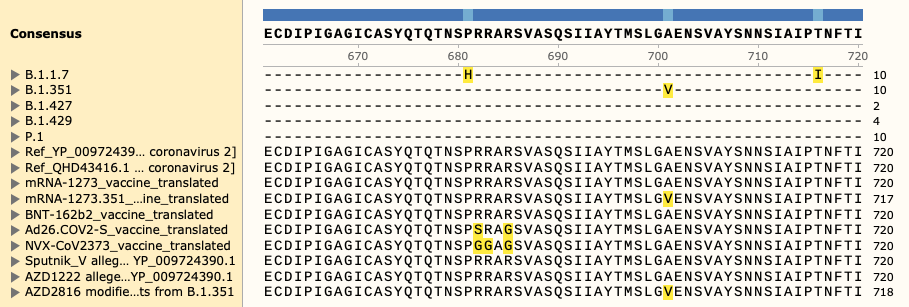

# Variants of concern aligned to SARS-CoV-2 vaccine coding sequences

This work has not been peer reviewed.

[Open PDF visualisation - variants_of_concern_to_vaccine.pdf](./variants_of_concern_to_vaccine.pdf)

## Aims and results
* To produce standardized alignments of vaccine sequences.
* Determine which are at risk to emerging variants.

From the data presented within:

1. The translated amino acid sequences for all vaccines were derived.
2. These were aligned to the SARS-CoV-2 reference amino acid sequences of spike (S) glycoprotein.
3. Known variants-of-concern were then annotated and visualised.

## Overview
Variants-of-concern for five SARS-CoV-2 strains 
([CDC 4 Jun 2021](https://www.cdc.gov/coronavirus/2019-ncov/variants/variant-info.html?CDC_AA_refVal=https%3A%2F%2Fwww.cdc.gov%2Fcoronavirus%2F2019-ncov%2Fcases-updates%2Fvariant-surveillance%2Fvariant-info.html))
are illustrated against the 
translated amino acid sequences of the vaccines; 

* Moderna mRNA-1273
* Pfizer/BioNTech BNT-162b2
* Janssen/Johnson & Johnson Ad26.COV2-S
* Novavax NVX-CoV2373
* Curevac CVnCoV
* Sputnik V
* AstraZeneca AZD1222

and reference protein/genome sequences;

* QHD43416.1 [MN908947.3] and
* YP\_009724390.1 [NC\_045512.2].

The variants-of-concern are shown here, illustrated on the protein structure;
[6ZOX.pdb DOI: 10.2210/pdb6ZOX/pdb](https://www.rcsb.org/structure/6ZOX)
_Structure of Disulphide-stabilized SARS-CoV-2 Spike Protein Trimer (x2 disulphide-bond mutant, G413C, V987C, single Arg S1/S2 cleavage site),_
provided by Xiong et al., 2020 [10.1038/s41594-020-0478-5](https://www.nature.com/articles/s41594-020-0478-5).

* [6zox_voc_20210604_front.jpg](./pdb/renders/6zox_voc_20210604_front.jpg)
* [6zox_voc_20210604_side.jpg](./pdb/renders/6zox_voc_20210604_side.jpg)
* [6zox_voc_20210604_top.jpg](./pdb/renders/6zox_voc_20210604_top.jpg)

Two of the defining genetic features that are different between vaccines are seen here, 
* the S glycoprotein furin cleavage modification region (p.682-685)

* the S glycoprotein stabilization modification region (p.986-987)

Visual alignment is shown against translated coding sequence for spike glycoprotein,
illustrated here via 

[nextstrain.org](https://nextstrain.org/sars-cov-2).

Fasta sequences are included for:

* Variants of Concern B.1.1.7
* Variants of Concern B.1.351
* Variants of Concern B.1.427
* Variants of Concern B.1.429
* Variants of Concern P.1
* Ref QHD43416.1 [MN908947.3]
* Ref YP\_009724390.1 [NC\_045512.2]
* mRNA-1273 vaccine translated
* BNT-162b2 vaccine translated
* Ad26.COV2-S vaccine translated
* NVX-CoV2373 vaccine translated
* Sputnik V alleged unmodified YP_009724390.1
* AZD1222 alleged unmodified YP_009724390.1

## Vaccine list
We are tracking vaccines under WHO Emergency Use Listing and prequalification (WHO EUL/PQ) evaluation process.



You can read about our data sources in 
[vaccine_list.md](vaccine_list/vaccine_list.md).
We have reproduced the vaccine coding sequences for each vaccine that has a _finalized_ status under the WHO EUL/PQ evaluation process.

| No. | Manufacturer / WHO EUL holder                                          | Name of Vaccine                                                                                         | NRA of Record | Platform                                                                                                                     | EOI accepted                                               | Pre- submission meeting held                       | Dossier accepted for review                                             | Status of assessment                                                                                                                           | Anticipated decision date                                          |
|--:--|------------------------------------------------------------------------|---------------------------------------------------------------------------------------------------------|---------------|------------------------------------------------------------------------------------------------------------------------------|------------------------------------------------------------|----------------------------------------------------|-------------------------------------------------------------------------|------------------------------------------------------------------------------------------------------------------------------------------------|--------------------------------------------------------------------|
| 1   | Pfizer/Biontech                                                        | BNT162b2 (COMIRNATY Tozinameran (INN))                                                                  | EMA           | Nucleoside modified mNRA                                                                                                     | Yes                                                        | Yes                                                | Yes                                                                     | Finalized                                                                                                                                      | 31.12.20                                                           |
| 2.1 | Oxford-AstraZeneca                                                     | AZD1222                                                                                                 | EMA           | Recombinant ChAdOx1 adenoviral vector encoding the Spike protein antigen of the SARS-CoV-2.                                  | Yes                                                        | Yes                                                | Accepted core data, Data for Covax sites expected in April 2021 onwards | Finalized core data, Finalised sites: SK-Catalent 16 April 2021, Wuxi (DS)  30 April 2021, Chemo Spain 04 June 2021, Other sites As submitted. | 16.Apr.21                                                          |
| 2.2 | Oxford-AstraZeneca                                                     | AZD1222                                                                                                 | MFDS KOREA    | Recombinant ChAdOx1 adenoviral vector encoding the Spike protein antigen of the SARS-CoV-2.                                  | Yes                                                        | Yes                                                | Yes                                                                     | Finalized                                                                                                                                      | 15.Feb.21                                                          |
| 3   | Serum Institute Of India                                               | ChAdOx1_nCoV-19 (Covishield)                                                                            | DCGI          | Recombinant ChAdOx1 adenoviral vector encoding the Spike protein antigen of the SARS-CoV-2.                                  | Yes                                                        | Yes                                                | Yes                                                                     | Finalized                                                                                                                                      | 15.Feb.21                                                          |
| 4   | Janssen Infectious Disease and Vaccines                                | Ad26.COV2.S                                                                                             | EMA           | Recombinant, replication- incompetent adenovirus type 26 (Ad26) vectored vaccine encoding the (SARS-CoV-2) Spike (S) protein | Yes                                                        | Yes                                                | Core data Yes, Additional sites: Aspen South Africa - Other sites       | Finalized: US +NL sites, Ongoing: other sites                                                                                                  | 12.Mar.21                                                          |
| 5   | Moderna                                                                | mRNA-1273                                                                                               | EMA           | mNRA-based vaccine encapsulated in lipid nanoparticle (LNP)                                                                  | Yes                                                        | Yes                                                | Yes                                                                     | Finalized                                                                                                                                      | 30.Apr.21                                                          |
| 6   | Sinopharm / BIBP (Beijing Bio-Institute of Biological Products Co-Ltd) | SARS-CoV-2 Vaccine (Vero Cell), Inactivated (lnCoV)                                                     | NMPA          | Inactivated, produced in Vero cells                                                                                          | Yes                                                        | Yes                                                | Yes                                                                     | Finalized                                                                                                                                      | 07.May.21                                                          |
| 7   | Sinovac                                                                | SARS-CoV-2 Vaccine (Vero Cell), Inactivated                                                             | NMPA          | Inactivated, produced in Vero cells                                                                                          | Yes                                                        | Yes                                                | Yes                                                                     | Finalized                                                                                                                                      | 01.Jun.21                                                          |
| 8   | The Gamaleya National Center of Epidemiology and Microbiology          | Sputnik V                                                                                               | Russian NRA   | Human Adenovirus Vector- based Covid-19 vaccine                                                                              | Additional information submitted                           | Several meetings held.                             | Rolling submission of clinical and CMC data has started.                | Additional data (Non- CLIN, CLIN, CMC) Required. Inspections in April, May and June 2021                                                       | Will be set after all data is submitted and inspections completed. |
| 9   | CanSinoBIO                                                             | Ad5-nCoV                                                                                                | NMPA          | Recombinant Novel Coronavirus Vaccine (Adenovirus Type 5 Vector)                                                             | Yes                                                        | Yes                                                | Rolling data starting June 2021                                         | NA                                                                                                                                             | NA                                                                 |
| 10  | Novavax                                                                | NVX-CoV2373 (Covovax)                                                                                   | EMA           | Recombinant nanoparticle prefusion spike protein formulated with Matrix-M adjuvant.                                          | Yes                                                        | Yes                                                | NA                                                                      | NA                                                                                                                                             | NA                                                                 |
| 11  | Sinopharm / WIBP (Wuhan Institute of Biological Products Co Ltd)       | Inactivated SARS-CoV-2 Vaccine (Vero Cell)                                                              | NMPA          | Inactivated, produced in Vero cells                                                                                          | EOI submiited on 30 April and more on 26 May 2021.         | Planned for 14 June 2021                           | NA                                                                      | NA                                                                                                                                             | NA                                                                 |
| 12  | Urevac                                                                 | Zorecimeran (INN) concentrate and solvent for dispersion for injection; Company code: CVnCoV/CV07050101 | EMA           | mNRA-based vaccine encapsulated in lipid nanoparticle (LNP)                                                                  | EOI submitted on 12 April                                  | Planned for 15 July 2021, based on company request | NA                                                                      | NA                                                                                                                                             | NA                                                                 |
| 13  | Bharat Biotech, India                                                  | COVAXIN                                                                                                 | DCGI          | SARS-CoV-2 Vaccine, Inactivated (Vero Cell)                                                                                  | EOI submitted on 19/04/2021. More information required.    | planned in June 2021                               | NA                                                                      | NA                                                                                                                                             | NA                                                                 |
| 14  | Vector State Research Centre of Viralogy and Biotechnology             | EpiVacCorona                                                                                            | Russian NRA   | Peptide antigen                                                                                                              | Letter received not EOI. Reply sent on 15/01/2021          | NA                                                 | NA                                                                      | NA                                                                                                                                             | NA                                                                 |
| 15  | Zhifei Longcom, China                                                  | Recombinant Novel Coronavirus Vaccine (CHO Cell)                                                        | NMPA          | Recombinant protein subunit                                                                                                  | Response to 2nd EOI sent 29 Jan 2021. Additional expected. | NA                                                 | NA                                                                      | NA                                                                                                                                             | NA                                                                 |

## Vaccine sequences summarised
<!--[HGVS-style notation](https://varnomen.hgvs.org/recommendations/protein/variant/delins/) is used for standardized reporting.-->

* mRNA-1273
	- Genetics: p.(Lys986_Val987delinsProPro)			- stabilizing x2 (PP)
	- Delivery: Lipid-nanoparticle

* BNT162b2
	- Genetics: p.(Lys986_Val987delinsProPro)			- stabilizing x2 (PP)
	- Delivery: Lipid-nanoparticle

* Ad26.COV2-S
	- Genetics: p.[Arg682Ser;p.Arg685Gln]				- furin cleavage x2 (SRAG)
	- Genetics: p.(Lys986_Val987delinsProPro)			- stabilizing x2 (PP)
	- Delivery: Adenovirus vector (Ad26)

* NVX-CoV2373
	- Genetics: p.[Arg682_Arg683delinsGlnGln;Arg685Gln]	- furin cleavage x3 (GGAG)
	- Genetics: p.(Lys986_Val987delinsProPro)				- stabilizing x2 (PP)
	- Delivery: Lipid-nanoparticle, baculovirus expression cultured in Sf9

* Sputnik V
	- Genetics: "unmodified" full-length S-protein 
	- Genetics: No reference sequence found
	- Delivery: Adenovirus vectors (Ad26 dose 1) and (Ad5 dose 2)

* Incomplete others:

* CVnCoV
	- Genetics: modified S protein.

* AZD1222
	- Genetics: Unmodified S protein
	- Genetics: No reference sequence found
	- Adenovirus vector (ChAdOx1).

* CoronaVac
	- a preparation of inactivated SARS-CoV-2 virions.

## Vaccine details
* BioNTech/Pfizer: BNT162b2
	- Modified mRNA-in-lipid-nanoparticle vaccine
	- Expressing a modified S protein.
	- Stabiliazation by proline substitutions p.K986P, p.V987P.

* Moderna: mRNA-1273
	- Modified mRNA-in-lipid-nanoparticle vaccine
	- Expressing a modified S protein.
	- Stabiliazation by proline substitutions p.K986P, p.V987P.

* Janssen/Johnson & Johnson: Ad26.COV2-S aka JNJ-78436735
	- [Pre-prindt](https://www.biorxiv.org/content/10.1101/2020.07.30.227470v1), [Published](https://www.nature.com/articles/s41541-020-00243-x).
	- Adenovirus serotype 26 (Ad26) viral vector vaccine
	- Expressing a modified S protein.
	- S protein of SARS-CoV-2 corresponding to positions 21,536–25,384 in SARS-CoV-2 isolate Wuhan-Hu-1 (genome MN908947 (18-MAR-2020))[Published](https://www.nature.com/articles/s41541-020-00243-x).
	- For Ad26.S.PP, the two stabilising variants p.(Lys986_Val987delinsProPro) are included as well as two mutations in the furin cleavage site that preserve the prefusion conformation and blocks shedding of S1.  
	- The furin cleavage site was abolished by amino acid changes p.R682S and p.R685G.
	- Stabiliazation by proline substitutions p.K986P, p.V987P.
	- [HGVS notation](https://varnomen.hgvs.org/recommendations/protein/variant/delins/) would be: p.[Arg682Ser;p.Arg685Gln] and p.(Lys986_Val987delinsProPro).

* Novavax: NVX-CoV2373
	- A protein subunit vaccine containing a doubly modified S protein, with adjuvant.
	- Part of a 27.2nm nanoparticle. 
	- S protein of SARS-CoV-2 corresponding to GenBank MN908947 nucleotides 21563-25384 [as published](https://www.ncbi.nlm.nih.gov/pmc/articles/PMC7584426/).
	- Contains the modified S protein with the two Proline substitutions, K986P and V987P. Additionally, three amino acids are changed (682-RRAR-685 to 682-QQAQ-685) to protect the protein against proteases.
	- [HGVS notation](https://varnomen.hgvs.org/recommendations/protein/variant/delins/) would be: p.[Arg682_Arg683delinsGlnGln;Arg685Gln] and p.(Lys986_Val987delinsProPro),
a simple list would even be better: p.R682Q, p.R683Q, p.R685Q, p.K986P, and p.V987P.
	- Saponin-based Matrix-M adjuvent.
	- Protein expression by a baculovirus in an Sf9 insect infection culture.
	- [Pre-print](https://www.biorxiv.org/content/10.1101/2020.06.29.178509v1.full.pdf)
	- Delivery in lipid nanoparticle

* Gamaleya Research Institute of Epidemiology and Microbiology: Sputnik V 
	- aka Гам-КОВИД-Вак (Gam-COVID-Vac).
	- Two differnt adenovirus viral vectors.
	- Uses two different adenovirus serotypes; [recombinant Ad26 (dose 1) and recombinant Ad5 (dose 2)](https://sputnikvaccine.com/about-vaccine/).
	- Both carrying the gene for Spike glycoprotein (rAd26-S and rAd5-S).
	- Antigen insert is an "unmodified" full-length S-protein (no reference sequence).
	- Produced in HEK293 cell line.
	- No reference sequence found
	- The first major paper [Logunov et al Lancet. 2020] is this clinical trial of frozen and lyophilised vaccine. It mentions previous unpublished pre-clinical trials. [Published](https://www.ncbi.nlm.nih.gov/pmc/articles/PMC7471804/).

* Curevac: CVnCoV
	- Unmodified mRNA-in-lipid-nanoparticle vaccine
	- Expressing a modified S protein.
	- Based on genome from first isolate [NC\_045512.2](https://www.ncbi.nlm.nih.gov/nuccore/NC_045512.2), Spike glycoprotein [YP\_009724390.1](https://www.ncbi.nlm.nih.gov/protein/YP_009724390.1).
	- full-length S featuring K986P and V987P mutations.
	- <https://pubmed.ncbi.nlm.nih.gov/33863911/>

* Oxford/AstraZeneca: AZD1222 (formerly ChAdOx1 nCoV-19)
	- A viral vector vaccine 
	- Viral vector (ChAdOx1 - chimpanzee adenovirus Oxford 1, [as published](https://pubmed.ncbi.nlm.nih.gov/22808149/))
	- Expressing the unmodified S protein.
	- No reference sequence found
	- [Folegatti et al, Lancet July 2020](http://www.thelancet.com/retrieve/pii/S0140673620316044)

## Naming SARS-CoV-2 variants
According to the [WHO](https://www.who.int/en/activities/tracking-SARS-CoV-2-variants/),
the established nomenclature systems for naming and tracking SARS-CoV-2 genetic lineages by [GISAID](https://www.gisaid.org), [Nextstrain](https://nextstrain.org) and [Pango](https://cov-lineages.org) are currently and will remain in use by scientists and in scientific research. 
These variant codes are essential for efficient lineage tracking. 
The [WHO](https://www.who.int/en/activities/tracking-SARS-CoV-2-variants/) labels (e.g. Alpha, Beta, Gamma), are practical for non-scientific audiences. 
The labels from [GISAID](https://www.gisaid.org), [Nextstrain](https://nextstrain.org) and [Pango](https://cov-lineages.org) are useful for technical discussion (e.g. B.1.1.7, GRY, 20I/S:501Y.V1). 
However, when considering the task of matching vaccine sequence to viral sequence, labelling individual variants is ideal.

In spite of best efforts to control infection, vaccine resistance may arise due to individual or multiple variants-of-concern. 
Quickly identifying individual variant effect is imperative. 
Strain labels are defined according the relative phylogenetic position and therefore contain additional information about unrelated "benign" variants, that is not pertinent to our task.
Tracking variants-of-concern based strain labels alone does not provide sufficient defence since the individual variant-of-concern may spontaneously arise in another genetically distant strain. 

For reproducing vaccine sequences and SARS-CoV-2 variants-of-concern,
we use coordinate positions relative to the reference sequence
for S glycoprotein protein
[QHD43416.1](https://www.ncbi.nlm.nih.gov/protein/QHD43416.1)
from complete genome [MN908947.3](https://www.ncbi.nlm.nih.gov/nuccore/mn908947.3) 
(date: 18-MAR-2020).

Vaccine developers generally report their genetic modifications with positions relative to their original reference sequence (usually also matching our chosen reference).
Some vaccine developers do not report any reference sequence. 
In such cases we used the same QHD43416.1 (MN908947.3) reference to represent their allegedly unmodified sequence.

[HGVS-recommended nomenclature](https://varnomen.hgvs.org/recommendations/protein) for protein variation is designed for human genome variants rather than for viral genetics. 
However, their guidelines are particularly reliable for complex genetic combinations, providing unambiguous clarity.
This style has been used for more reliable standardized reproduction of vaccine genetics derived from primary sources.

## Vaccine genetic design
In a [hypothetical example](hypothetical_example.md), 
a new viral mutation could arise that poses a risk due to resistance against _some_ vaccines. 
Most vaccines are currently based on expression of full-length SARS-CoV2 S glycoprotein.
Currently, the genetic design component of vaccines use one of three designs types (1), (2) or (2+3): 

1. Unmodified protein
2. Stabilization modified
3. Furin cleavage modified

There are also slight genetic differences between vaccines that use the same genetic modification strategies.
Therefore, we would like to efficiently and accurately map individual variants-of-concern to each vaccine coding sequence and pre-emptively identify those at risk in the event of resistance. 

## Reference genome sequence
The two reference sequences that are used by vaccine developers are;

* Complete genome DNA and translated coding sequences:
	- [MN908947.3](https://www.ncbi.nlm.nih.gov/nuccore/mn908947.3)
	- Protein ID for spike glycoprotein [QHD43416.1](https://www.ncbi.nlm.nih.gov/protein/QHD43416.1)
	- Date: 18-MAR-2020
	- This the same translated protein sequence as that is referred to based on genomic coordinates [coded_by MN908947.3:21563..25384](https://www.ncbi.nlm.nih.gov/protein/QHD43416.1)

* Complete genome DNA and translated coding sequences:
	- [NC\_045512.2](https://www.ncbi.nlm.nih.gov/nuccore/NC_045512.2), 
	- Protein ID for spike glycoprotein [YP\_009724390.1](https://www.ncbi.nlm.nih.gov/protein/YP_009724390.1).
	- Date: 18-JUL-2020 
	- This the same translated protein sequence as that is referred to based on genomic coordinates [NC_045512.2:21563-25384 translated GU280_gp02](https://www.ncbi.nlm.nih.gov/nuccore/NC_045512)

Both reference sequences are provided in files:

[reference_sequence_MN908947.3.md](sarscov2_reference_sequence/reference_sequence_MN908947.3.md)
[reference_sequence_NC_045512.2.21563-25384.md](sarscov2_reference_sequence/reference_sequence_NC_045512.2.21563-25384.md)

## Vaccine sequence reproduction
The sequences for vaccines have been reproduced by careful reconstruction based on 

1. The authors' reported reference sequence and 
2. The description of the genetic modifications used during vaccine development. 

For each vaccine, a review of the primary literature was performed to find the exact coding sequence and reference sequence. 
For those with no coding sequence provided (the majority), 
the authors' description of genetic modification was used to reconstruct the vaccine coding sequence. 
This sequence, along with the construction methods is provided in the fasta file matching the vaccine name.
The primary sources are provided in each case, along with a detailed description of the genetic variants provided by authors.

**For visual simplicity, an X symbol was used to illustrate amino acid deletions**.
All other amino acid changes use their correct symbol.

For vaccines BNT-162b2 and mRNA-1273, the assemblies have also been sourced from [NAalytics](https://github.com/NAalytics/Assemblies-of-putative-SARS-CoV2-spike-encoding-mRNA-sequences-for-vaccines-BNT-162b2-and-mRNA-1273).
This data matches the vaccine sequences that have been reproduced here based on primary literature.
Briefly, 
their experimental sequence information from the initial 
Moderna ([Corbett Nature 2020 Oct](https://pubmed.ncbi.nlm.nih.gov/32756549/))
and Pfizer/BioNTech ([Polack NEJM 2020 Dec](https://pubmed.ncbi.nlm.nih.gov/33301246/))
COVID-19 vaccines, allowed them to produce a working assembly of the former 
and a confirmation of previously reported sequence information for the latter RNA.
Their data was sourced and formatted to select the coding sequences.
The nucleotide sequences were then translated into amino acid coding sequences
using <https://web.expasy.org/translate/>,
as shown in files:

[sarscov2_vaccine_sequence_translated_mRNA-1273.md](sarscov2_vaccine_sequences_translated/sarscov2_vaccine_sequence_translated_mRNA-1273.md)
[sarscov2_vaccine_sequence_translated_BNT-162b2.md](sarscov2_vaccine_sequences_translated/sarscov2_vaccine_sequence_translated_BNT-162b2.md)

## Vaccine multiple sequence alignment
The amino acid sequences of the coding region from each of the vaccine sequences 
and the reference sequence were used for multiple sequence alignment
via <https://www.ebi.ac.uk/Tools/msa/clustalo/>.

Variants-of-concern were then formatted to be used for annotation on the aligned sequences.

## Variants-of-concern
SARS-CoV-2 Variant Classifications and Definitions were derived from 
[www.cdc.gov/coronavirus/2019-ncov/variants/](https://www.cdc.gov/coronavirus/2019-ncov/variants/variant-info.html?CDC_AA_refVal=https%3A%2F%2Fwww.cdc.gov%2Fcoronavirus%2F2019-ncov%2Fcases-updates%2Fvariant-surveillance%2Fvariant-info.html)

This dataset includes:

* Variants of Interest (VOI)
* Variants of Concern (VOC)
* Variants of High Consequence (VOHC)

The reformatted tables are presented in files:

[variants_of_concern.xlsx](variants_of_concern.xlsx)
[variants_of_concern.csv](variants_of_concern.csv)

There are currently no VOHC. 
VOC (but not VOI) were presented in the final visualisation.

## Aligned variants-of-concern to vaccine

The variants of concern were formatted such that one pseudo-fasta format entry 
contains the amino acid change for each strain. 
This data was then added to the multiple sequence alignment file to allow for
aligned annotations,
as shown in file:

[variants_of_concern_to_vaccine.fa](variants_of_concern_to_vaccine.fa)

The file contains the list the variants-of-concern for five Sars-CoV-2 strains,
2 reference sequence, and
6 vaccine sequences:

* Variants of Concern B.1.1.7
* Variants of Concern B.1.351
* Variants of Concern B.1.427
* Variants of Concern B.1.429
* Variants of Concern P.1
* Ref QHD43416.1 [MN908947.3]
* Ref YP\_009724390.1 [NC\_045512.2]
* mRNA-1273 vaccine translated
* BNT-162b2 vaccine translated
* Ad26.COV2-S vaccine translated
* NVX-CoV2373 vaccine translated
* Sputnik V alleged unmodified YP_009724390.1
* AZD1222 alleged unmodified YP_009724390.1

Different strains will contain benign variants.
Typically, full sequences are used for alignment. 
However, this can be visually distracting.
Instead, only the variants-of-concern are annotated for the strain sequences. 

The final illustration was made using <https://www.snapgene.com> software.
The snapgene-software formatted output can be loaded with the file:

[variants_of_concern_to_vaccine.praln](variants_of_concern_to_vaccine.praln)

The final PDF version is shown in file:
[Open PDF visualisation](./variants_of_concern_to_vaccine.pdf)
[variants_of_concern_to_vaccine.pdf](./variants_of_concern_to_vaccine.pdf)

## Main files

The main files that might interst you are listed here together.
Other files that are not listed contain intermediate data.

* [README.md](https://github.com/DylanLawless/variants_of_concern_to_vaccine_SARS*CoV2#readme)

* [reference_sequence_NC_045512.2.21563-25384.md](sarscov2_reference_sequence/reference_sequence_NC_045512.2.21563-25384.md)
* [reference_sequence_MN908947.3.md](sarscov2_reference_sequence/reference_sequence_MN908947.3.md)

* [sarscov2 vaccine sequence translated mRNA-1273.md](sarscov2_vaccine_sequences_translated/sarscov2_vaccine_sequence_translated_mRNA-1273.md)
* [sarscov2 vaccine sequence translated BNT-162b2.md](sarscov2_vaccine_sequences_translated/sarscov2_vaccine_sequence_translated_BNT-162b2.md)
* [sarscov2 vaccine sequence translated NVX-CoV2373.md](sarscov2_vaccine_sequences_translated/sarscov2_vaccine_sequence_translated_NVX-CoV2373.md)
* [sarscov2 vaccine sequence translated Ad26.COV2-S.md](sarscov2_vaccine_sequences_translated/sarscov2_vaccine_sequence_translated_Ad26.COV2-S.md)
* [sarscov2 vaccine sequence translated AZD1222.md](sarscov2_vaccine_sequences_translated/sarscov2_vaccine_sequence_translated_AZD1222.md)
* [sarscov2 vaccine sequence translated NVX-CoV2373.md](sarscov2_vaccine_sequences_translated/sarscov2_vaccine_sequence_translated_NVX-CoV2373.md)
* [sarscov2 vaccine sequence translated Sputnik-V.md](sarscov2_vaccine_sequences_translated/sarscov2_vaccine_sequence_translated_Sputnik-V.md)

* [variants_of_concern.xlsx](variants_of_concern.xlsx)
* [variants_of_concern.csv](variants_of_concern.csv)
* [variants_of_concern_to_vaccine.fa](variants_of_concern_to_vaccine.fa)
* [variants_of_concern_to_vaccine.praln](variants_of_concern_to_vaccine.praln)
* [variants_of_concern_to_vaccine.pdf](variants_of_concern_to_vaccine.pdf)

* [Protein structure, original structure file](pdb/6zox.pdb)
* [Protein structure, VMD visualisation state 6zox_voc_20210604_stage.vmd](pdb/6zox_voc_20210604_stage.vmd)
* [Protein structure with variants of concern 6zox_voc_20210604_front.jpg](./pdb/renders/6zox_voc_20210604_front.jpg)
* [Protein structure with variants of concern 6zox_voc_20210604_side.jpg](./pdb/renders/6zox_voc_20210604_side.jpg)
* [Protein structure with variants of concern 6zox_voc_20210604_top.jpg](./pdb/renders/6zox_voc_20210604_top.jpg)

## Other notes
* [notes.md](notes.md)

## About
Location: [Switzerland, Canton Vaud](https://goo.gl/maps/Xv1bY6Tgn4a5ccwN9)

<!--  -->

Created for open-science by: [https://lawlessgenomics.com](https://lawlessgenomics.com)

[Contact - Resume - CV](https://dylan-lawless.github.io)

Host-pathogen genomic scientist. PhD (Medicine in Genetics and Immunology), MSc (Immunology), BSc (Microbiology)

Contribute via the original repository at [github.com/DylanLawless](https://github.com/DylanLawless/SARS-CoV-2-VOC.github.io).
With minimalism and privacy in mind, this site is built to be light and fast as well as containing [no ads, trackers, cookies, &c](https://themarkup.org/blacklight?url=sarscov2variants.com). [CC-BY-4.0](https://creativecommons.org/licenses/by/4.0/).
<!-- https://www.paypal.com/donate?hosted_button_id=7K3CD4KDMKPBS -->
