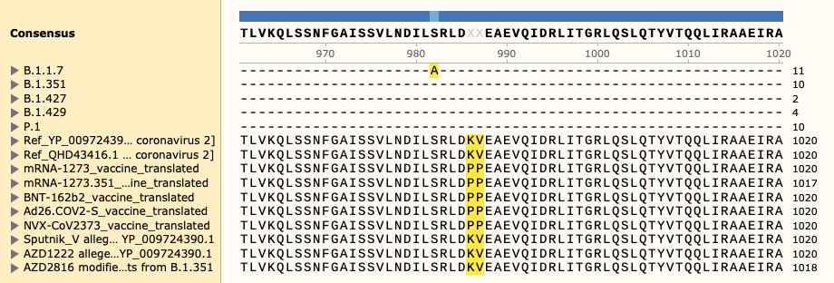
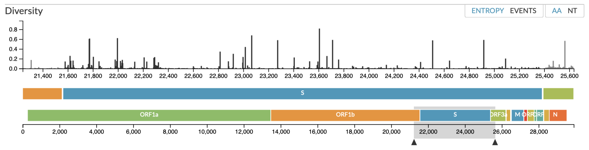

If our live vaccine sequence alignment viewer has problems loading in your browser, [you can visit it here via NCBI.](https://www.ncbi.nlm.nih.gov/projects/msaviewer/?anchor=-1&coloring=fbd&key=pRY_z7kUZs3KOijK6SseNE6aNkhpOWc8azpDLFcoRQbUCmFht1uDivkLzMQh61SWBY5Ymka-HbtaoU6sSKpEsXaYS5Znqk0,rB82xrAdb8TDMyHD4CIXPUeTP05gP246YjxKKl4uTADdDGhnvl3zKFwSaczBx3G6IKJ9tmOSOJd_jWuAbYZhnVO0brpChmg&track_config=protein_default&from=608&to=756&columns=d:120,b:55,x:17,aln,e:55,o:150)

# Variants of concern aligned to SARS-CoV-2 vaccine coding sequences
In the event of SARS-CoV-2 vaccine-resistant strain emergence, we would like to quickly determine which vaccines are affected.
Differences in national vaccination coverage, vaccine efficacy, viral phylogenetics, and infection reporting means that a robust statistical analysis of vaccine-resistance will be unlikely to return actionable findings as quickly as needed.
Understanding each vaccine design and having a detailed comparison of vaccine coding sequences is critical for pre-emptively assessing the risk. 

Disturbingly, despite the expectation of scientific rigor, almost no _complete_ genetic coding sequence data has been published from vaccine producers. 
Some designers have provided a description of genetic modifications relative to a known reference genome - precluding protection of intellectual property as an explanation. 
Here we compile data from vaccine designers and major health organisations to define the similarities and differences between each vaccine.
We target the coding sequences for vaccines on the World Health Organization (WHO) Prequalification (PQ) Units’ Emergency Use Listing (EUL) and compare them against variants-of-concern in circulating SARS-CoV-2 strains. 

* _Currently, there are no variants of high concern_.

## Aims and results overview
[Open PDF visualisation - variants_of_concern_to_vaccine.pdf](../data/variants_of_concern_to_vaccine.pdf)

> Note: This work has not been peer reviewed. Every care has been taken by the authors to report accurate and sourced material, however caution is advised. This material is provided under live development to promote open-science. 

* To produce standardized alignments of vaccine sequences.
* Determine which are at risk to emerging variants.

From the data presented within:

1. The translated amino acid sequences for all vaccines were derived.
2. These were aligned to the SARS-CoV-2 reference amino acid sequences of spike (S) glycoprotein.
3. Known variants-of-concern were then annotated and visualised.

Variants-of-concern for five SARS-CoV-2 strains 
([CDC 4 Jun 2021](https://www.cdc.gov/coronavirus/2019-ncov/variants/variant-info.html?CDC_AA_refVal=https%3A%2F%2Fwww.cdc.gov%2Fcoronavirus%2F2019-ncov%2Fcases-updates%2Fvariant-surveillance%2Fvariant-info.html))
are illustrated against the 
translated amino acid sequences of the vaccines; 

* Moderna mRNA-1273
* Pfizer/BioNTech BNT-162b2
* Janssen/Johnson & Johnson Ad26.COV2-S
* Novavax NVX-CoV2373
* Curevac CVnCoV
* Sputnik V
* AstraZeneca AZD1222
* AstraZeneca AZD2816
* BBIBP-CorV Sinopharm [(no published data)](pages/vaccine_seq_recovered)

and reference protein/genome sequences;

* QHD43416.1 [MN908947.3] and
* YP\_009724390.1 [NC\_045512.2].

The variants-of-concern are shown here, illustrated on the protein structure;
[6ZOX.pdb DOI: 10.2210/pdb6ZOX/pdb](https://www.rcsb.org/structure/6ZOX)
_Structure of Disulphide-stabilized SARS-CoV-2 Spike Protein Trimer (x2 disulphide-bond mutant, G413C, V987C, single Arg S1/S2 cleavage site),_
provided by Xiong et al., 2020 [10.1038/s41594-020-0478-5](https://www.nature.com/articles/s41594-020-0478-5).

* [6zox_voc_20210604_front.jpg](./pdb/renders/6zox_voc_20210604_front.jpg)
* [6zox_voc_20210604_side.jpg](./pdb/renders/6zox_voc_20210604_side.jpg)
* [6zox_voc_20210604_top.jpg](./pdb/renders/6zox_voc_20210604_top.jpg)

Two of the defining genetic features that are different between vaccines are seen here, 
* the S glycoprotein furin cleavage modification region (p.682-685)

* the S glycoprotein stabilization modification region (p.986-987)

Visual alignment is shown against translated coding sequence for spike glycoprotein,
illustrated here via 

[nextstrain.org](https://nextstrain.org/sars-cov-2).

Fasta sequences are included for:

* Variants of Concern B.1.1.7
* Variants of Concern B.1.351
* Variants of Concern B.1.427
* Variants of Concern B.1.429
* Variants of Concern P.1
* Ref QHD43416.1 [MN908947.3]
* Ref YP\_009724390.1 [NC\_045512.2]
* mRNA-1273 vaccine translated
* BNT-162b2 vaccine translated
* Ad26.COV2-S vaccine translated
* NVX-CoV2373 vaccine translated
* Sputnik V alleged unmodified YP_009724390.1
* AZD1222 alleged unmodified YP_009724390.1
* AZD2816 modified YP_009724390.1 with variants from B.1.351

## How we source and anlyze our data

[Vaccine list](pages/Vaccine_list) - Tables of all vaccines in trials and all vaccines with WHO EUL/PQ finalized reports that we use for our main analysis.

[Vaccine sequences summarised](pages/Vaccine_sequences_summarised.md) - A short overview of the delivery methods and genetic modifications for vaccine coding sequences are required for our main analysis. 

[Vaccine details](pages/Vaccine_details.md) - A longer set of pertinent details about each vaccine that are required for interpreting the risk upon emergence of vaccine resistant variants.

[Naming SARS-CoV-2 variants](pages/Naming_SARS-CoV-2_variants.md) - Technical details of the established nomenclature systems for naming and tracking SARS-CoV-2 genetic lineages. Additional recommendations for tracking variants-of-concern based on coding position coordinates and aligning all WHO EUL/PQ finalized vaccine coding sequences for pre-emptive planning. 

[Vaccine genetic design](pages/Vaccine_genetic_design.md) - Overview of the coding sequence genetics used by vaccine designers. Illustrates the similarities and differences between each vaccine, with or without genetic modification for an improved immune response. Critical for establishing the effect of variants-of-concern that may affect multiple vaccination strategies. 

[Vaccine sequence reproduction](pages/Vaccine_sequence_reproduction.md) - Detailed information about the construction of our coding sequence alignments. Reproduction of vaccine genetic designs using primary literature and reference sequence data. 

[Variants-of-concern](pages/Variants-of-concern.md) - Overview of the variants-of-concern as reported by the CDC. Currently no variants of high-concern are reported. 

[Variants-of-concern aligned to vaccine](pages/Variants-of-concern_aligned_to_vaccine.md) - Details about the combination of variants-of-concern and vaccine coding sequences. Produces a visual map of SARS-CoV-2 variants against each vaccine coding sequence, which is responsible for S protein expression. Emergence of viral strains containing new S protein variants may produce epitopes that fail to initiate sufficient vaccine-stimulated immune recognition.

[Main file for download](pages/Main_files.md) - The main files that might be useful to researchers, containing raw and processed data, are listed here together. Other files that are not listed but are present in the data folder will contain intermediate data.

[Other notes](notes.md) - Other notes with snippets and temporary, related material. 

[What is this?](pages/what_is_this.md) - A summary of why it is important to generate this information and share it publicly. Why coding sequence design may be subverted by confounding terms in popular media.

<!--  -->

## About
<!--  -->

Location: [Switzerland, Canton Vaud](https://goo.gl/maps/Xv1bY6Tgn4a5ccwN9)

Created in support of open-science by: [https://lawlessgenomics.com](https://lawlessgenomics.com)

[Contact - Resume - CV](https://dylan-lawless.github.io)

Host-pathogen genomic scientist. PhD (Medicine in Genetics and Immunology), MSc (Immunology), BSc (Microbiology)

Contribute via the original repository at [github.com/DylanLawless](https://github.com/DylanLawless/SARS-CoV-2-VOC.github.io).
With minimalism and privacy in mind, this site is built to be light and fast. 
This site containing no ads, cookies, &c. However, one analytics tracker is included for counting page views to [determine our resource requirements](https://themarkup.org/blacklight?url=sarscov2variants.com). 

[CC-BY-4.0](https://creativecommons.org/licenses/by/4.0/).
<!-- https://www.paypal.com/donate?hosted_button_id=7K3CD4KDMKPBS -->
